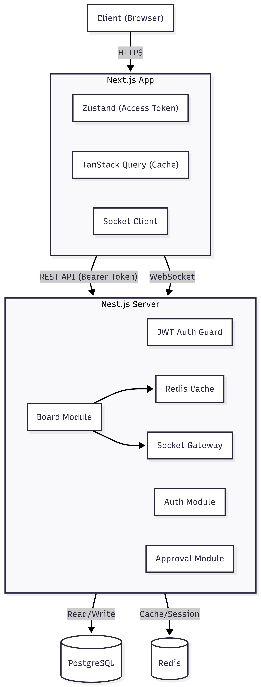

## Description

<p align="center">
  <a href="http://nestjs.com/" target="blank"></a>
</p>

<p align="center">A progressive <a href="http://nodejs.org" target="_blank">Node.js</a> framework for building efficient and scalable server-side applications.</p>

<p align="center">
    
    
    
</p>

<p align="center">
    
    
    
    
</p>

---

## 🛠 Tech Stack

본 프로젝트는 안정적이고 확장 가능한 백엔드 시스템 구축을 위해 아래의 기술 스택을 사용합니다.

| Category          | Technology     | Description                                         |
| :---------------- | :------------- | :-------------------------------------------------- |
| **Framework**     | **Nest.js**    | 모듈식 아키텍처를 제공하는 Node.js 서버 프레임워크  |
| **Language**      | **TypeScript** | 정적 타입 시스템을 통한 안정성 및 생산성 향상       |
| **Database**      | **PostgreSQL** | 복잡한 관계형 데이터 처리 및 무결성 보장에 유리     |
| **ORM**           | **TypeORM**    | 객체와 관계형 데이터베이스 간의 매핑 및 쿼리 관리   |
| **Cache & Queue** | **Redis**      | 데이터 캐싱, Socket.io 어댑터, Refresh Token 저장소 |
| **Real-time**     | **Socket.io**  | 양방향 실시간 통신 Gateway 구현                     |
| **Storage**       | **AWS S3**     | 이미지 및 파일 업로드를 위한 클라우드 스토리지      |

## ⚙️ Key Features

- **Authentication**: JWT & Redis를 활용한 보안 로그인 및 세션 관리
- **Real-time Communication**: Socket.io + Redis Adapter를 이용한 확장 가능한 실시간 통신
- **Data Integrity**: PostgreSQL의 ACID 트랜잭션 및 TypeORM을 이용한 데이터 관리
- **File Management**: AWS S3를 연동한 안전하고 빠른 파일 처리

## Architecture



## Project setup

```bash
$ pnpm install
```

## Compile and run the project

```bash
# development
$ pnpm start:dev

# production mode
$ pnpm start:prod
```

## Run tests

```bash
# unit tests
$ pnpm test

# e2e tests
$ pnpm test:e2e

# test coverage
$ pnpm test:cov
```

## Deployment

When you're ready to deploy your NestJS application to production, there are some key steps you can take to ensure it runs as efficiently as possible. Check out the [deployment documentation](https://docs.nestjs.com/deployment) for more information.

If you are looking for a cloud-based platform to deploy your NestJS application, check out [Mau](https://mau.nestjs.com), our official platform for deploying NestJS applications on AWS. Mau makes deployment straightforward and fast, requiring just a few simple steps:

```bash
$ pnpm add -g @nestjs/mau
$ mau deploy
```

With Mau, you can deploy your application in just a few clicks, allowing you to focus on building features rather than managing infrastructure.

## Resources

Check out a few resources that may come in handy when working with NestJS:

- Visit the [NestJS Documentation](https://docs.nestjs.com) to learn more about the framework.
- For questions and support, please visit our [Discord channel](https://discord.gg/G7Qnnhy).
- To dive deeper and get more hands-on experience, check out our official video [courses](https://courses.nestjs.com/).
- Deploy your application to AWS with the help of [NestJS Mau](https://mau.nestjs.com) in just a few clicks.
- Visualize your application graph and interact with the NestJS application in real-time using [NestJS Devtools](https://devtools.nestjs.com).
- Need help with your project (part-time to full-time)? Check out our official [enterprise support](https://enterprise.nestjs.com).
- To stay in the loop and get updates, follow us on [X](https://x.com/nestframework) and [LinkedIn](https://linkedin.com/company/nestjs).
- Looking for a job, or have a job to offer? Check out our official [Jobs board](https://jobs.nestjs.com).

## Support

Nest is an MIT-licensed open source project. It can grow thanks to the sponsors and support by the amazing backers. If you'd like to join them, please [read more here](https://docs.nestjs.com/support).

## Stay in touch

- Author - [Kamil Myśliwiec](https://twitter.com/kammysliwiec)
- Website - [https://nestjs.com](https://nestjs.com/)
- Twitter - [@nestframework](https://twitter.com/nestframework)

## License

Nest is [MIT licensed](https://github.com/nestjs/nest/blob/master/LICENSE).
